# .Net项目基础框架

# 一、文档

## 1.1 概述

.net项目基础框架，基于云原生下的微服务设计，其核心目标是轻量级、敏捷开发、易上手、易扩展、模块插件化


## 1.2 特性

**插件化**：组件化服务提供者，开发者按需启用

**微服务**：

- 按照领域划分服务
- 自主开发，独立部署
- 使用标准通信协议与其他服务通信
- 组合在一起形成一个应用

**云原生架构**：

- 可以更频繁地根据新想法采取行动
- 更快地响应不断变化的需求
- 更轻松地运行弹性和可扩展的应用程序
- 提高架构的可移植性
- 模块隔离
- 容器化技术

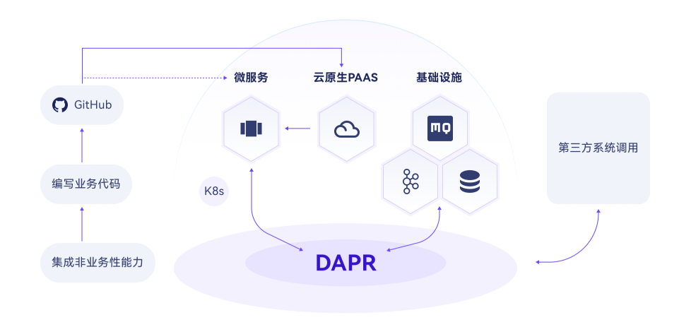


## 1.3 领域驱动设计

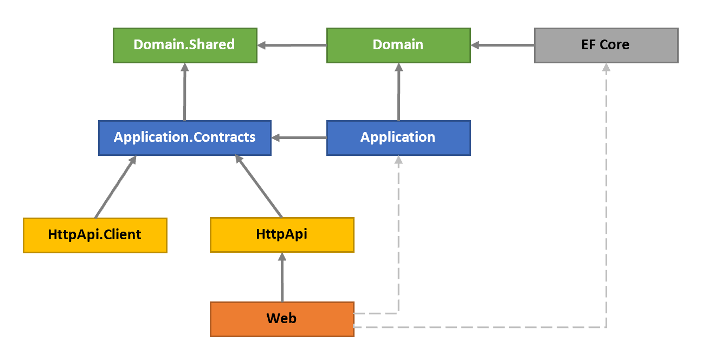

**业务逻辑**分为两层,分别为 **_领域(Domain)_ 层**和 **_应用(Application)_ 层**,它们包含不同类型的业务逻辑.

- **领域层**:只实现领域业务逻辑,与用例无关.
- **应用层**:基于领域层来实现满足用例的业务逻辑.用例可以看作是用户界面(UI)或外部应用程序的交互.
- **展现层**:包含应用程序的 UI 元素.
- **基础设施层**:通过对第三方库的集成或抽象,来满足其它层的非核心业务逻辑的实现.

## 领域层构建组成

- **实体(Entity)**: [实体]是种领域对象,它有自己的属性(状态,数据)和执行业务逻辑的方法.实体由唯一标识符(Id)表示,不同 ID 的两个实体被视为不同的实体.
- **值对象(Value Object)**: [值对象]是另外一种类型的领域对象,使用值对象的属性来判断两个值对象是否相同,而非使用 ID 判断.如果两个值对象的属性值全部相同就被视为同一对象.值对象通常是不可变的,大多数情况下它比实体简单.
- **聚合(Aggregate) 和 聚合根(Aggregate Root)**: [聚合]是由**聚合根**包裹在一起的一组对象(实体和值对象).聚合根是一种具有特定职责的实体.
- **仓储(Repository)** (接口): [仓储]是被领域层或应用层调用的数据库持久化接口.它隐藏了 DBMS 的复杂性,领域层中只定义仓储接口,而非实现.
- **领域服务(Domain Service)**: [领域服务]是一种无状态的服务,它依赖多个聚合(实体)或外部服务来实现该领域的核心业务逻辑.
- **规约(Specification)**: [规约]是一种**强命名**,**可重用**,**可组合**,**可测试**的实体过滤器.
- **领域事件(Domain Event)**: [领域事件]是当领域某个事件发生时,通知其它领域服务的方式,为了解耦领域服务间的依赖.

### 应用层构建组成

- **应用服务(Application Service)**: [应用服务]是为实现用例的无状态服务.展现层调用应用服务获取 DTO.应用服务调用多个领域服务实现用例.用例通常被视为一个工作单元.
- **数据传输对象(DTO)**: [DTO]是一个不含业务逻辑的简单对象,用于应用服务层与展现层间的数据传输.
- **工作单元(UOW)**: [工作单元]是事务的原子操作.UOW 内所有操作,当成功时全部提交,失败时全部回滚.

### 领域层

领域层分为两个项目:

- `Demo.Domain`是**领域层中必需**的,它包含之前介绍的**构建组成**(实体,值对象,领域服务,规约,仓储接口等).
- `Demo.Domain.Shared`是领域层中**很薄的项目**,它只包含领域层与其它层共享的数据类型的定义.例如,枚举,常量等.

### 应用层

应用层也被分为了两个项目:

- `Demo.Application.Contracts`包含**接口**的定义及接口依赖的**DTO**,此项目可以被展现层或其它客户端应用程序引用.
- `Demo.Application`是**应用层中必需**的,它实现了 `Demo.Contracts`项目中定义的接口.

### 展现层

- `Demo.HttpApi.Host`是一个 ASP.NET Core MVC 应用程序.它是提供 API 服务的可执行程序.

### 远程服务层

- `Demo.HttpApi.Client`当 C#客户端应用程序需要调用 `Demo.HttpApi.Host`的 API 时,这个项目非常有用.客户端程序仅需引用此项目就可以通过依赖注入方式,远程调用应用服务.

### 基础设施层

- `Demo.EntityFrameworkCore`集成*EF Core*.应用程序的 `数据库上下文(DbContext)`,数据库对象映射,仓储接口的实现,以及其它与*EF Core*相关的内容都位于此项目中.


# 二、快速入门

## 2.1 初始化模板

**安装框架模板  dotnet new --install G6Tmp::1.0.3**

**创建业务项目  dotnet new g6web -n 项目名称**


## 2.2 依赖注入

框架没有对任何第三方DI提供程序的核心依赖, 但它必须使用一个提供程序来支持动态代理(dynamic proxying)和一些高级特性以便其特性能正常工作.启动模板中已安装了Autofac. 更多信息请参阅 [Autofac 集成](https://docs.abp.io/zh-Hans/abp/latest/Autofac-Integration) 文档


 **固有的注册类型**

一些特定类型会默认注册到依赖注入.例子:

- **MVC控制器（继承`Controller`或`BaseController`）被注册为transient.**
- **MVC页面模型（继承`PageModel`）被注册为transient.**
- **MVC视图组件（继承`ViewComponent`）被注册为transient.**
- **应用程序服务（实现`IApplicationService`接口或继承`ApplicationService`类）注册为scoped.（可通过控制依赖接口切换注入类型）**
- **存储库（实现`IRepository`接口）注册为scoped.**
- **基础组件 默认注册为singleton**


 **依赖接口**

如果实现这些接口,则会自动将类注册到依赖注入:

- **`ITransientDependency` 注册为transient生命周期.**
- **`ISingletonDependency` 注册为singleton生命周期.**
- **`IScopedDependency` 注册为scoped生命周期.**


示例：

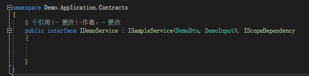


**基础框架默认注入**

此处需要业务应用手动注入

```C#
builder.AddGlasssixFramework()
app.UseGlasssixFramework(app.Lifetime);//确保顺序为最后
```


## 2.4 配置

基础配置详见项目模板 

参见 [微软文档](https://docs.microsoft.com/en-us/aspnet/core/fundamentals/configuration/)  

框架提供一个可拓展，灵活的配置系统，于微软默认Ioption<>接口进行拓展

安装如下包，或启用默认框架依赖

```
dotnet add package `Glasssix.BuildingBlocks.Configuration`
```


**如何使用：**

1.注册`GlasssixConfiguration`

```c#
builder.AddGlasssixConfiguration();
```

2.新增配置信息，修改文件`appsettings.json`

```
{
 "AppConfig": {
   "ConnectionStrings": {
     "DefaultConnection": "server=localhost;uid=sa;pwd=P@ssw0rd;database=identity"
   }
 }
```

3.创建`Appconfig`类

```c#
/// <summary>
/// 自动映射本地节点
/// </summary>
public class AppConfig : LocalGlasssixConfigurationOptions
{
    public ConnectionStrings ConnectionStrings { get; set; }//ConnectionStrings类默认存在于框架Data中，如不存在该依赖需要自己声明
}
```

4.获取`AppConfig`配置信息

```c#
// 通过DI获取到IOptions<AppConfig> options;
IOptions<AppConfig> options = serviceProvider.GetRequiredService<IOptions<AppConfig>>(); 
Console.WriteLine(options.Value.ConnectionStrings.DefaultConnection);
```


**高阶用法：**

利用`IOptionsMonitor`做配置监听，如发生local更改会触发更新事件，需开发者在业务侧预留更新事件

```c#
//可通过构造注入
IOptions<AppConfig> options = serviceProvider.GetRequiredService<IOptions<AppConfig>>();
options.OnChange((o, optionName) =>
        {
            if (optionName == name)
            {
                RefreshConfigurationOptions(o);
            }
        });
```


## 2.5 缓存

**使用方式**

**`IDistributedCacheClient` 接口**

框架定义了 `IDistributedCache` 接口用于 get/set 缓存值，

需要注意的是，使用此接口必须配置`redis`连接，且所有方法直接与`redis`产生交互

**`IMultilevelCacheClient` 接口**

多级缓存接口，`IDistributedCache` 接口基础上增加一层内存缓存用于降低网络传输损耗和redis内存压力及命中性问题

用于Get Set Remove等常见处理

流程如下：


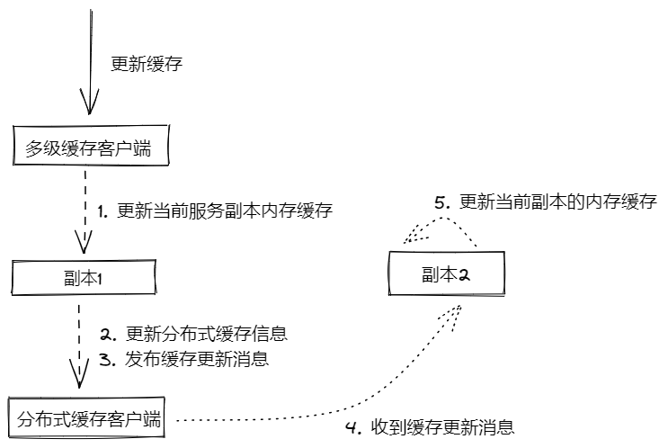


**缓存模块相对以前来说做了一定程度的修改，如下**：

- 增加Key类型，默认使用Type:Value形式  如：String:Key 【1.全量；2.Type:Value; 3.别名:Key】
- value值不在明文存储，增加3种可选项，默认使用3选项 【1.全量；2.压缩 3.压缩并反序列化】
- 去掉主动式过期，增加绝对过期，相对过期，滑动过期可选项


启用：

```c#
builder.AddGlasssixFramework()
    .AddCache(sp => builder.Configuration.GetSection("RedisConfig").Bind(sp));
```

使用示例：

```c#
using Glasssix.DotNet.Framework.Extensions;

public class Class
{
    private readonly IMultilevelCacheClient _redis;//多级缓存提供者

    public Class(IMultilevelCacheClient redis)
    {
        _redis = redis;
    }
    
    public async Task Foo()
    {
        var k = "k";
        var v = "v";
        await _redis.SetAsync("b", "123787087", new CacheEntryOptions(TimeSpan.FromMinutes(15)));
        var value = await _redis.StringGetAsync(k);
        await _redis.DeleteKeyAsync(k);
    }
}

```

注意：`IDistributedCacheClient`，`IMultilevelCacheClient`为不同能力提供者，据具体业务场景进行区分使用，禁止全部操作越过多级而直接调取`redis`提供者，常用`Get`、`Set`、`Remove`、`GetList`等增删改操作使用`IMultilevelCacheClient`即可

## 2.6 鉴权

鉴权模块使用**Identityserver4** 基于 **OpenID Connect** 和 **OAuth 2.0** 框架  [官方文档](https://identityserver4docs.readthedocs.io/zh_CN/latest/index.html)

其基础功能项：**身份验证即服务**，**单点登录/注销**，**API访问控制**

模块对此进行集成包装，并将配置功能等提供Web UI界面方式进行自定义配置

在启用前需要先针对一下内容进行了解

认证鉴权中心项目结构如下：

- **IdentityAuthServer.Admin 后台管理**

- **IdentityAuthServer.Admin.Api 鉴权中心开放Api接口文档**

- **IdentityAuthServer.STS.Identity 鉴权认证中心**


**授权端点说明**

**发现文档**

```
https://localhost:44310/.well-known/openid-configuration
```

| 字段                                  | 说明                                                         | 示例                                                         |
| ------------------------------------- | ------------------------------------------------------------ | ------------------------------------------------------------ |
| issuer                                | 发行网址，也就是说我们的权限验证站点                         | https://localhost:44310                                      |
| jwks_uri                              | 这个接口获取的是公钥，用于验证jwt的数字签名部分（数字签名由sso维护的私钥生成）用的 | https://localhost:44310/.well-known/openid-configuration/jwks |
| authorization_endpoint                | 授权服务器的授权端点的URL                                    | https://localhost:44310/connect/authorize                    |
| token_endpoint                        | 获取token的网址                                              | https://localhost:44310/connect/token                        |
| userinfo_endpoint                     | 根据token获取用户信息                                        | https://localhost:44310/connect/userinfo                     |
| end_session_endpoint                  | 登录注销                                                     | https://localhost:44310/connect/endsession                   |
| check_session_iframe                  | 客户端对check_session_iframe执行监视，可以获取用户的登出状态 | https://localhost:44310/connect/checksession                 |
| revocation_endpoint                   | 这个网址允许撤销访问令牌(仅access tokens 和reference tokens)。它实现了令牌撤销规范(RFC 7009) | https://localhost:44310/connect/revocation                   |
| introspection_endpoint                | introspection_endpoint是RFC 7662的实现。 它可以用于验证reference tokens(或如果消费者不支持适当的JWT或加密库，则JWTs)。 | https://localhost:44310/connect/introspect                   |
| device_authorization_endpoint         | 设备授权网址                                                 | https://localhost:44310/connect/deviceauthorization          |
| frontchannel_logout_supported         | 可选。基于前端的注销机制                                     | true                                                         |
| frontchannel_logout_session_supported | 可选。基于session的注销机制                                  | true                                                         |
| backchannel_logout_supported          | 指示OP支持后端通道注销                                       | true                                                         |
| backchannel_logout_session_supported  | 可选的。指定RP是否需要在注销令牌中包含sid(session ID)声明，以在使用backchannel_logout_uri时用OP标识RP会话。如果省略，默认值为false | true                                                         |
| scopes_supported                      | 支持的范围                                                   | [“openid”, “profile”, “email”, “api”, “api.scope1”, “api.scope2”, “scope2”, “policyserver.runtime”, “policyserver.management”, “offline_access”] |
| claims_supported                      | 支持的claims                                                 | [“sub”, “name”, “family_name”, “given_name”, “middle_name”, “nickname”, “preferred_username”, “profile”, “picture”, “website”, “gender”, “birthdate”, “zoneinfo”, “locale”, “updated_at”, “email”, “email_verified”] |
| grant_types_supported                 | 授权类型                                                     | [“authorization_code”, “client_credentials”, “refresh_token”, “implicit”, “password”, “urn:ietf:params:oauth:grant-type:device_code”] |
| response_modes_supported              | 支持的响应模式                                               | [“form_post”, “query”, “fragment”]                           |
| token_endpoint_auth_methods_supported | token端点支持的身份验证方式                                  | [“client_secret_basic”, “client_secret_post”]                |
| id_token_signing_alg_values_supported | 支持id token 里alg签名的值                                   | [“RS256”]                                                    |
| subject_types_supported               |                                                              | [“public”]                                                   |
| code_challenge_methods_supported      | 支持的代码质询方法                                           | [“plain”, “S256”]                                            |
| request_parameter_supported           | 支持的请求参数                                               | true                                                         |


**获取Token**

```
请求类型： post 
地址 /connect/token
头部请求标签 CONTENT-TYPE application/x-www-form-urlencoded
```

**例**

```
POST /connect/token
CONTENT-TYPE application/x-www-form-urlencoded

    client_id=client1&
    client_secret=secret&
    grant_type=authorization_code&
    code=hdh922&
    redirect_uri=https://myapp.com/callback
```

请求数据（Body）

| 参数          | 说明                                                         |
| ------------- | ------------------------------------------------------------ |
| client_id     | 客户标识符（必填）                                           |
| client_secret | 客户端机密，可以在帖子正文中，也可以作为基本身份验证标头使用 |
| grant_type    | 授权类型 ：<br/>授权码： authorization_code<br/>客户端：client_credentials<br/>用户密码： password<br/>刷新令牌： refresh_token<br/>补助类型： urn:ietf:params:oauth:grant-type:device_code |
| scope         | 一个或多个注册范围。如果未指定，将为所有明确允许的作用域发出令牌 |
| redirect_uri  | grant_type 为 authorization_code时必填                       |
| code          | 授权码。 grant_type 为 authorization_code时必填              |
| code_verifier | PKCE证明密钥                                                 |
| username      | 登入名 。grant_type 为 password时必填                        |
| password      | 登入名 。grant_type 为 password时必填                        |
| acr_values    | 允许传递有关password授权类型的其他与身份验证相关的信息-特殊情况下，identityserver使用以下专有acr_values：idp:name_of_idp 绕过登录/家庭领域屏幕，并将用户直接转发到选定的身份提供者（如果每个客户端配置允许）tenant:name_of_tenant 可用于将租户名称传递给令牌端点 |
| refresh_token | 刷新令牌。grant_type 为 refresh_token时必填                  |
| device_code   | 设备代码。 grant_type 为 urn:ietf:params:oauth:grant-type:device_code时必填 |


**进行授权**

```
请求类型： post 
地址 /connect/authorize
头部请求标签 CONTENT-TYPE application/x-www-form-urlencoded

```

**例**：

```
GET /connect/authorize?
    client_id=client1&
    scope=openid email api1&
    response_type=id_token token&
    redirect_uri=https://myapp/callback&
    state=abc&
    nonce=xyz
```


| 参数                  | 说明                                                         |
| --------------------- | ------------------------------------------------------------ |
| client_id             | 客户端的标识符（必需）                                       |
| request               | 您可以提供一部分或所有参数作为 JWT 提供，而不是将所有参数作为单独的查询字符串参数提供 |
| request_uri           | 包含请求参数的预打包 JWT 的 URL                              |
| scope                 | 一个或多个已注册的作用域（必需）                             |
| redirect_uri          | 必须与该客户端允许的重定向 URI 之一完全匹配（必需）          |
| response_type         | `id_token`请求标识令牌（仅允许标识作用域）<br/>`token`请求访问令牌（仅允许资源范围）<br/>`id_token token`请求标识令牌和访问令牌<br/>`code`请求授权代码<br/>`code id_token`请求授权代码和身份令牌<br/>`code id_token token`请求授权代码、身份令牌和访问令牌 |
| response_mode         | `form_post`将令牌响应作为表单帖子而不是片段编码的重定向发送（可选） |
| state                 | 身份服务器将在令牌响应上回显状态值， 这适用于客户端和提供者之间的往返状态，关联请求和响应以及 CSRF/重放保护。（推荐） |
| nonce                 | 身份服务器将回显身份令牌中的随机数值，这是为了重放保护）*通过隐式授予的标识令牌是必需的* |
| prompt                | `none`请求期间不会显示任何 UI。如果无法做到这一点（例如，因为用户必须登录或同意），则会返回错误<br/>`login`将显示登录 UI，即使用户已登录并具有有效的会话也是如此 |
| code_challenge        | 发送 PKCE 的代码质询                                         |
| code_challenge_method | plain`指示质询使用的是纯文本（不推荐） 表示质询已使用 SHA256 进行哈希处理`S256 |
| login_hint            | 可用于预填登录页面上的用户名字段                             |
| ui_locales            | 提供有关登录 UI 所需显示语言的提示                           |
| max_age               | 如果用户的登录会话超过最长期限（以秒为单位），将显示登录 UI  |
| acr_values            | 允许传入与身份验证相关的其他信息 - 身份服务器特殊情况下为以下专有acr_values：<br/>`idp:name_of_idp`绕过登录/主领域屏幕，将用户直接转发到选定的身份提供程序（如果每个客户端配置允许）<br/>`tenant:name_of_tenant`可用于将租户名称传递给登录 UI |

其他端点及详细模型文档参看 [端点文档 )](https://identityserver4.readthedocs.io/en/latest/endpoints/authorize.html)


**基础配置**

注：认证中心配置需要额外配置，此处只讲在该前提下如何在项目中进行配置项启用

```
#以下参数均需要先前往鉴权认证中心进行申请注册

string identityUrl="";//sts主机地址
string clientId="";//客户端Id
string scope="";//作用域
builder.AddIdentityClient(identityUrl, clientId, scope)//启用鉴权 
```


**控制台管理**

认证鉴权中心提供一套webUi用于基础项信息快速配置，详见**IdentityAuthServer.Admin**主机端点


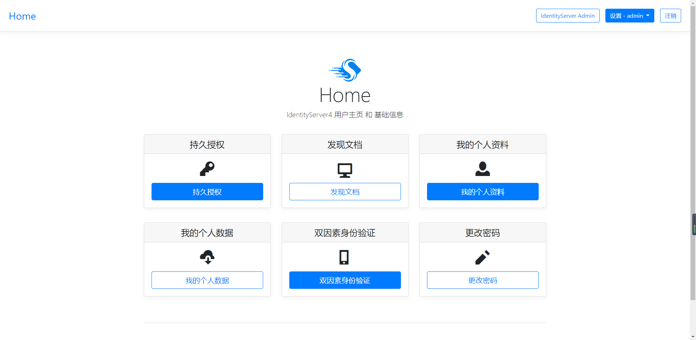


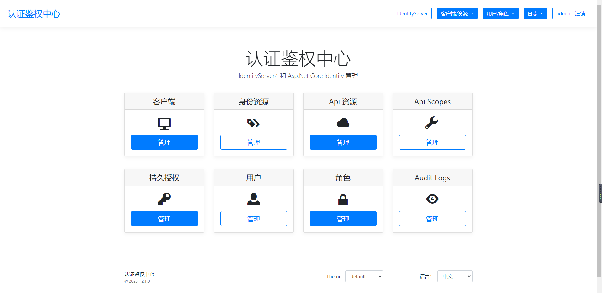


**开放Api**

提供针对外部调用api，针对客户端,作用域,Api,角色,用户等

如下：

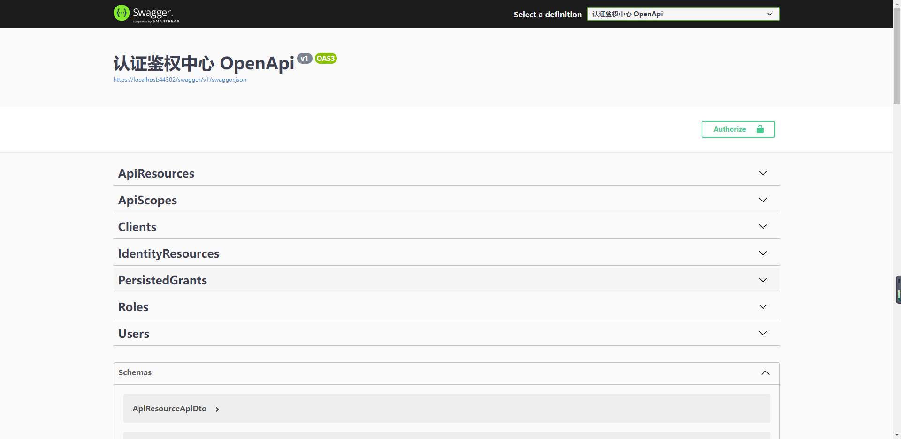


**基于Api的访问保护**

**控制器上标注【Authorize】特性即可**

若要限制特定角色访问，则标注为【Authorize(Roles ="")】

自定义策略配置可通过重写DI进行实现


**进行SwaggerUI 保护:**

```C#
builder.Services.AddSwaggerGen(option =>
{
    option.SwaggerDoc("v1", new OpenApiInfo
    {
        Title = "DemoApi - Demo HTTP API",
        Version = "v1",
        Description = "The Demo Service HTTP API"
    });
    option.AddSecurityDefinition("oauth2", new OpenApiSecurityScheme
    {
        Type = SecuritySchemeType.OAuth2,
        Flows = new OpenApiOAuthFlows()
        {
            AuthorizationCode = new OpenApiOAuthFlow
            {
                AuthorizationUrl = new Uri(identityUrl + "/connect/authorize"),
                TokenUrl = new Uri(identityUrl + "/connect/token"),
                Scopes = new Dictionary<string, string> { { "demoscope", "Demo API - full access" } }
            }
        }
    });
    //异常过滤输出
    option.OperationFilter<AuthorizeCheckOperationFilter>();
    //接口备注信息
    var file = Path.Combine(AppContext.BaseDirectory, "Dome.HttpApi.Host.xml");  // xml文档绝对路径
    var path = Path.Combine(AppContext.BaseDirectory, file); // xml文档绝对路径
    option.IncludeXmlComments(path, true); // true : 显示控制器层注释
    option.OrderActionsBy(o => o.RelativePath);
    option.EnableAnnotations();
});


    app.UseSwagger();
    app.UseSwaggerUI(setup =>
    {
        setup.OAuthClientId("demo_api_swaggerui");
        setup.OAuthAppName("示例服务 Swagger UI");
        setup.OAuthScopes("demoscope");
        setup.OAuthUsePkce();
    });
```


## 2.7 反射

命名空间 ReflectionConductor

1. 静态类型 Reflection

   说明：提供了属性***\*DisplayAttribute\****、***\*DisplayNameAttribute\****、***\*DescriptionAttribute\**** 成员获取的静态方法；类型***\*PropertyInfo\****、***\*MemberInfo\****、***\*Assembly\****、***\*Type\****反射相关的静态方法。

  2.类型 TypeFinder

  说明：提供了程序集和类型相关操作的方法封装


## 2.8 映射

静态类型 **MapperExtensions** 

  说明：对**Automapper**的静态封装。

​    静态方法 **TDestination MapTo<TSource, TDestination>(this TSource source, TDestination destination)**：
​        将source与destination相同的属性赋值给destination。

​        var entity1 = MapperExtensions.MapTo(dto, entity);

​    静态扩展方法 **TDestination MapTo<TDestination>(this object source) where TDestination : new()**：
​       将任意对象转换成一个新的对象，新对象的类型与原对象的类型相同的属性将会赋值给新的对象。

```
var dto = entity.MapTo<TDto>();
```

 静态扩展方法 **List<TDestination> MapToList<TDestination>(this IEnumerable source)**
       将一个集合转换为新的集合，相同的属性将会被赋值。

```
var dtos = entities.MapTo<TDto>();
```


## 2.9 日志

简介：日志中间件使用<a href="https://github.com/serilog/serilog">Serilog</a>的扩展 默认启用

配置为**控制台**输出日志：

```json
  "Serilog": {
    "MinimumLevel": {
      "Default": "Debug", //最小记录日志级别
      "Override": {
        "System": "Warning",
        "Microsoft": "Warning"
      }
    },
    "Enrich": [ "FromLogContext", "WithThreadId" ],
    "WriteTo": [
      {
        "Name": "Console",
        "Args": {
          "outputTemplate": "[{Level:u3}]{Timestamp:yyyy-MM-dd HH:mm:ss.fff} {SourceContext} {ThreadId} {Message:lj}{NewLine}{Exception}"
        }
      },
      {
        "Name": "Debug",
        "Args": {
          "outputTemplate": "[{Level:u3}]{Timestamp:yyyy-MM-dd HH:mm:ss.fff} {SourceContext} {ThreadId} {Message:lj}{NewLine}{Exception}"
        }
      }
    ]
  }
```

配置为**Elasticsearch**输出日志：

```json
  "Serilog": {
    "MinimumLevel": {
      "Default": "Debug", //最小记录日志级别
      "Override": {
        "System": "Warning",
        "Microsoft": "Warning"
      }
    },
    "Enrich": [ "FromLogContext", "WithThreadId" ],
    "WriteTo": [
      {
        "Name": "Elasticsearch",
        "Args": {
        "Uris": "http://127.0.0.1:9200/",
        "IndexFormat": "my-tweet-index-{0:yyyy.MM}",
        "UserName": "username",
        "Password": "password"
      },
      {
        "Name": "Console",
        "Args": {
          "outputTemplate": "[{Level:u3}]{Timestamp:yyyy-MM-dd HH:mm:ss.fff} {SourceContext} {ThreadId} {Message:lj}{NewLine}{Exception}"
        }
      },
      {
        "Name": "Debug",
        "Args": {
          "outputTemplate": "[{Level:u3}]{Timestamp:yyyy-MM-dd HH:mm:ss.fff} {SourceContext} {ThreadId} {Message:lj}{NewLine}{Exception}"
        }
      }
    ]
  }
```


## 2.10 限流

简介：基于redis，令牌桶算法实现的配置化限流中间件

配置以及说明：

```json
{
 "RedisTokenBucketAlgorithmOptions": {
    "Capacity": 20000, //最大容量
    "InflowQuantityPerUnit": 2000,//单位时间内流入数量
    "InflowUnit": 60, //单位时间/秒
    "LockSeconds": 10 //限流后的锁定时间/秒
  }
}
```

启用：

```c#
builder.AddGlasssixFramework()
 .AddRateLimit(builder.Configuration["RedisConfig"], sp => builder.Configuration.GetSection("RateLimit").Bind(sp));
```

#.7新增固定窗口限流算法

方法名称无改变 多态使用


# 三、基础设施

考虑到组件版本维护问题，不再开出相应单独模块包

统一集成进基础框架模块中，相关使用及版本迭代、只对此进行版本升级

**Nuget地址:http://192.168.15.11:7777/nuget**

**Nuget包名称:**  **Glasssix.DotNet.Framework** 

~~~~powershell
PM> dotnet add package Glasssix.DotNet.Framework
~~~~

**启用**：

~~~~C#
builder.AddGlasssixFramework()
app.UseGlasssixFramework(app.Lifetime);//确保顺序为最后
~~~~


## 3.1 数据仓储

数据访问方面 框架被设计为与数据库无关, 它通过仓储和工作单元抽象处理来自任何类型的数据源.

 **EF**

1.  DI

   ~~~~ C#
   builder.AddGlasssixFramework()
       .AddDbContext<DemoDbContext>(builder.Configuration["ConnectionString"])
   ~~~~
   
3. 使用

   Model:

   ~~~~ C#
       //IPassivable //ICreationTime //IModificationTime
       public class Demo : AggregateRoot<Demo, long>, ICreationTime, IModificationTime
       {
           public Demo() : base(0L)
           {
   
           }
   
           public Demo(long id) : base(id)
           {
   
           }
           public DateTime? CreationTime { get; set; }
           public DateTime? LastModificationTime{ get; set; }
       }
   ~~~~
   

Repository:

~~~~c#
       public class DemoRepository : BaseRepository<Model.Demo, long>, IDemoRepository
       {
           public DemoRepository(IUnitOfWork unitOfWork) : base(unitOfWork)
           {
   
           }
       }
~~~~


IRepository:

~~~~c#
       public interface IDemoRepository : IRepository<Model.Demo, long>
       {
   
       }
~~~~


**【注】：支持自动注入，在无特殊自定义需求下，直接构造注入`IRepository<Model.Demo, long>`即可**


**Dapper**

1.  DI

   ~~~~ C#
   builder.AddGlasssixFramework()
   .AddOrmDapper(builder.Configuration["ConnectionString"],false)//是否启用分表，是否进行分表生命周期托管
   ~~~~
   
3. IOC

   ~~~~ C#
   private readonly IDapper<object> _dapper;
   
   public XXXController(IDapper<object> dapper)
         {
           _dapper = dapper;
         }
   ~~~~

4. Methods

   4.1 获取数据列表

   ~~~~c#
      _dapper.QueryAsync<T>(string cmd, object param = null, bool OnSubmeter = true, CommandType? commandType = null, IDbTransaction transaction = null);
   ~~~~

   4.2 分页获取数据列表

   ~~~~C#
       _dapper.QueryPageAsync<T>(string cmd, int skip = 1, int limit = 10, object param = null, bool OnSubmeter = true, CommandType? commandType = null, IDbTransaction transaction = null);
   ~~~~

   4.3 执行cmd

   ~~~~c#
      _dapper.ExecuteAsync(string cmd, object? param = null, bool beginTransaction = false);
   ~~~~

   4.4 添加

   ~~~~C#
      _dapper.InsertAsync<T>(T? entity = null, bool beginTransaction = false, string? tableName = null);
   ~~~~

   4.5 修改

   ~~~~c#
      _dapper.UpdateAsync<T>(T entity, bool beginTransaction = false, string? tableName = null);
   ~~~~

   4.6 删除信息

   ~~~~c#
      _dapper.DeleteAsync<T>(T entity, string tableName = null);
   ~~~~

   4.7 获取所有信息

   ~~~~C#
      _dapper.GetAllInfo<T>();
   ~~~~

   4.8 通过ID获取信息

   ~~~~C#
      _dapper.GetInfoByIdAsync<T>(string id);
   ~~~~

   4.9 批量新增信息

   ~~~~C#
      _dapper.InsertListAsync<T>(IEnumerable<T> entities, string? tableName = null, bool beginTransaction = false);
   ~~~~

   4.10 批量修改信息

   ~~~~C#
      _dapper.UpdateListAsync<T>(IEnumerable<T> entities, string? tableName = null, bool beginTransaction = false);
   ~~~~

   4.11 批量删除信息

   ~~~~c#
      _dapper.DeleteListAsync<T>(IEnumerable<T> entitys, string? tableName = null, bool beginTransaction = false);
   ~~~~

   4.12 判断表是否存在

   ~~~~C#
      _dapper.ExistsTableAsync(string tableName);
   ~~~~

   

**SqlSugar**

1.  StartUp

   ~~~~ C#
   builder.AddGlasssixFramework()   
   	.AddOrmSqlSugar(builder.Configuration["ConnectionString"]);
   ~~~~
   
3. Controllers

   ~~~~ C#
    using var _sugar = SqlSugarHelper.GetClient();
   ~~~~

4. Methods

   参考官方文档 <a href="https://gitee.com/idsutong/SqlSugar/">SqlSugar</a>


## 3.4 后台任务

**xxlJob**


1.  appsettings.json

   ~~~~json
     "xxlJob": {
       "adminAddresses": "http://10.168.1.47:32712/xxl-job-admin", //调度服务平台的地址
       "appName": "test-xxljob1", //执行器的名称,与调度平台配置的名称必须一致
       "specialBindAddress": "", //被调度的服务地址192.168.0.102
       "port": 5045, //被调度的服务端口
       "autoRegistry": true,
       "accessToken": "",
       "logRetentionDays": 30,
       "logPath ": "/LogFile",
       "username": "admin",
       "password": "123456",
       "jobGroup": "33",
       "ApiUrl": "jobinfo/"
     }
   ~~~~

3. DI

   ~~~~ C#
   builder.AddGlasssixFramework() 
       .AddScheduler();//可选自动注册执行者、自定义
   ~~~~
   
4. IOC

   ~~~~c#
   private readonly IBaseServiceFactory _service;
   
   public XXXController(IBaseServiceFactory baseService)
         {
            _service = baseService;
         }
   ~~~~

5. 使用

   ~~~~ C#
   var model = new VisitorXxlJobOption(ScheduleType.Cron, "0 22 11 1 6 ? 2023");
   //var model = new VisitorXxlJobOption(ScheduleType.FIX_RATE, "30");
   model.author = ".Net";
   model.executorHandler = "TestHandler";
   model.jobDesc = "测试任务12313";
   model.id = 268;
   var sdsds = await _service.TryUpdate(model);
   _service.Invoke("268", TaskStateType.Stop);
   _service.Invoke("268", TaskStateType.trigger);
   _service.Invoke("268", TaskStateType.Start);
   _service.Invoke("268", TaskStateType.Remove);
     
   var result = await _service.GetTaskPageList(new TaskQueyInput() { executorHandler = "TestHandler", jobGroup = 33 });
   ~~~~


## 3.5 事件总线

**概述**：事件总线是对发布-订阅模式的一种实现，是一种集中式事件处理机制，允许不同的组件之间进行彼此通信而又不需要相互依赖，达到一种解耦的目的

事件总线是将消息从发送方传输到接收方的中介. 它在对象,服务和应用程序之间提供了一种松散耦合的通信方式.

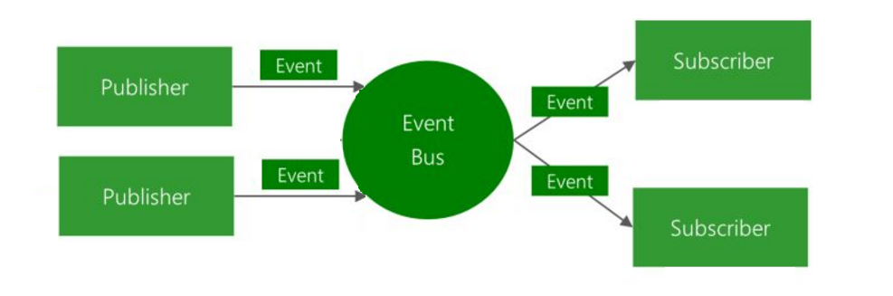

**分布式事件总线**

分布式事件总线系统允许**发布**和**订阅跨应用/服务边界**传输的事件. 你可以使用分布式事件总线在**微服务**或**应用程序**之间异步发送和接收消息

**当前只实现了基于Rabbitmq服务提供者实例**

启用：

~~~~c#
builder.AddGlasssixFramework()
    .EventBus(sp => builder.Configuration.GetSection("rabbitmq").Bind(sp))
~~~~


**发布事件**

可以注入 `IEventBus` 并且使用发布分布式事件.

**示例: 发送人员同步发布分布式事件**

```C#
    public record PersonSyncMessagesEvent : IntegrationEvent
    {
        public List<PersonSyncStateDto> Data { get; set; } 
    }
```


```c#
public class MyService  
    {
        private readonly IEventBus _eventBus;

        public MyService(IEventBus eventBus)
        {
            _eventBus = eventBus;
        }
  		  var model = new PersonSyncMessagesEvent();
 				 _eventBus.Publish(model);
    }
```


**订阅事件**

**示例: 接收方订阅并触发相关业务逻辑**

```C#
 public class PersonSyncEventHandler : IIntegrationEventHandler<PersonSyncMessagesEvent>
    {
        private readonly ILogger<PersonSyncEventHandler> _logger;

        public PersonSyncEventHandler(ILoggerFactory loggerFactory)
        {
            _logger = loggerFactory.CreateLogger<PersonSyncEventHandler>();

        }

        public Task Handle(PersonSyncMessagesEvent @event)
        {
            _logger.LogInformation("Subscribe EventType:{EventType} EventId:{EventId}", "PersonSyncEventHandler", @event.Id);

            return Task.CompletedTask;
        }
    }
```

```c#
var eventBus = app.Services.GetRequiredService<IEventBus>();
eventBus.Subscribe<PersonSyncMessagesEvent, PersonSyncEventHandler>();
```


## 3.6 配置中心


通过以下几个问题理解微服务中的集中配置中心:

1. **微服务配置中心是什么？**
2. **为什么需要微服务配置中心？**
3. **微服务配置中心实现技术？**
4. **技术如何选型？**
5. **微服务配置中心是什么：**

集中式配置是将应用系统中对配置信息的管理作为一个新的应用功能模块，区别与传统的配置信息分散到系统各个角落方式，进行集中统一管理，并且提供额外功能。尤其是在微服务架构中，是不可或缺组件，甚至是必要组件之一。

为什么需要微服务配置中心：

在微服务体系中，服务的数量以及配置信息的日益增多，比如各种服务器参数配置、各种数据库访问参数配置、各种环境下配置信息的不同、配置信息修改之后实时生效等等，传统的配置文件方式或者将配置信息存放于数据库中的方式已无法满足开发人员对配置管理的要求，如：

- 安全性：配置跟随源代码保存在代码库中，容易造成配置泄漏；

- 时效性：修改配置，需要重启服务才能生效；

- 局限性：无法支持动态调整：例如日志开关、功能开关；

  

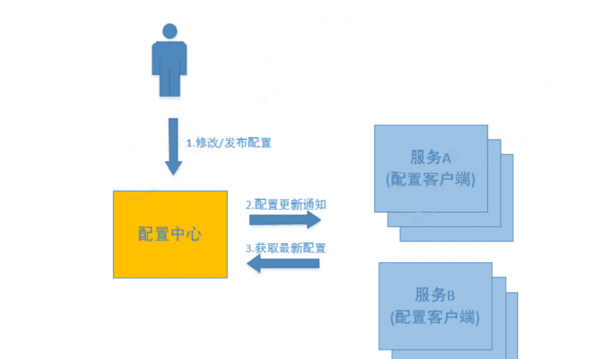

在此之前，框架使用的是携程开源的第三方组件Apollo

具备基本的功能，但是对公司当前业务场景并不友好，单实例模式下即使配置进行了热重载，也无法将已经建立的组件实例进行销毁重建

实际使用中，还是需要开发或运维人员进行手动重启

为此框架自身实现配置中心功能，于**Glasssix.Buidingblock.Configuration**包中

在经过测试后将在下版本迭代中投入使用


## 3.7 服务发现

服务发现是指使用一个注册中心来记录分布式系统中的全部服务的信息，以便其他服务能够快速的找到这些已注册的服务。

意思就是，所有服务器（无论是同一种APP的多个服务器，还是不同APP的多个服务器）在启动时，都需要在“注册中心”进行注册；客户端发送“请求”的时候，需要从“注册中心”获取它所属APP的服务器（有可能是多个服务器，即获取到某个服务的服务器列表）的地址信息。

从客户端角度来看，注册中心起到的作用包含两个：

1. 可以知道是否存在某个APP的服务器；
2. 在客户端发送请求时，需要从注册中心获取相关服务器的地址信息。
3. 从客户端角度来看，这是一种“服务发现”的机制。

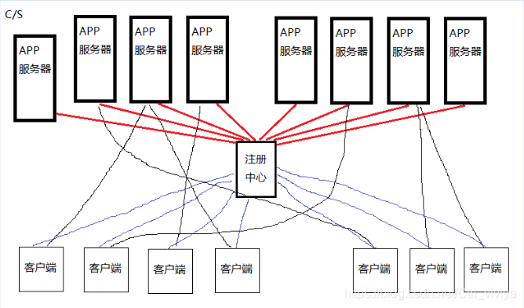


随着云原生时代的到来，放弃服务自托管交由给K8s进行服务注册发现机制，

**考虑到特殊业务场景，框架保留传统微服务模式下的服务发现，服务提供程序使用Consul+ocelot**

1.  appsettings.json

   ~~~~json
     "Consul": {
       "Enabled": true,  //是否启用
       "Host": "http://127.0.0.1:8500",   //Consul主机地址
       "HealthCheckPath": "healthcheck",  //健康检查地址
       "App": { //应用信息
         "Name": "WebApi1", //应用名称
         "Scheme": "http", //协议
         "Host": "localhost",  //应用主机地址
         "Port": 5000,  //应用监听端口
         "Tags": "" //标签
       }
     },
   ~~~~

2. DI

   ~~~~ C#
    builder.AddGlasssixFramework()
       .AddConsul(sp => builder.Configuration.GetSection("Consul").Bind(sp))
   ~~~~


## 3.8 服务调用

提供服务调用的能力, 通过它可以调用其它服务, Caller被设计为与提供者无关

目前的提供者有:

-   Glasssix.Contrib.Caller.HttpClient 基于**HttpClient**实现的Caller 
-   Glasssix.Contrib.Caller.DaprClient基于**DaprClient**实现的Caller


**对于传统分布式微服务，即使我们根据分散式微服务应用程序的原则、模式和做法，去设计新的企业应用程序并重新构建现有企业应用程序的平台**

但仍旧逃不过将单一程序模块构造为**单一整体式单元**的魔咒,如下：

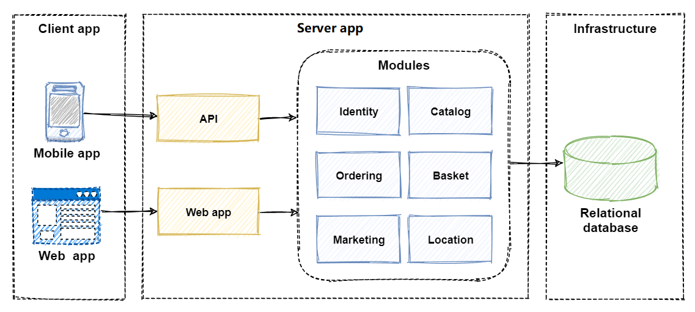

**应用程序数据存储在一个共享数据库中。 业务功能通过 HTML 和 RESTful 接口公开**

从许多方面来说，整体式应用可以算是 直截了当， 我们可以轻松地对它们执行以下操作：

- 构建
- 测试
- 部署
- 疑难解答
- 纵向缩放（纵向扩展）

但是，整体式体系结构可能会带来很大的挑战，随着时间的推移，可能会逐渐失去控制

- 整体模式会变得过于复杂，致使没有人能够理解它
- 你担心要做出更改，因为每个更改都会带来意想不到且代价高昂的副作用
- 新功能/修补程序的实现会变得耗时且成本高昂
- 即使是最细微的更改也需要完整部署整个应用程序 - 成本高昂且有风险
- 一个不稳定的组件可能会使整个系统崩溃
- 不能选择增加新的技术和框架
- 难以实现敏捷交付方法
- 代码基会因为不断发生的定制化而发生退化，从而导致体系结构变弱


**分布式体系结构**

现在，我们将设计为**分散式分布式体系结构**，它包含一定的特点， 每项服务都是自包含的，并封装其自己的代码、数据和依赖项。 每一项都部署在软件容器中，由容器业务流程协调程序管理。 每项服务都拥有一个专用数据库，而不是多项服务共享单一数据库。 其他服务不能直接访问此数据库，并且仅能访问通过拥有该数据库的服务的公共 API 公开数据。

但是它带来了一定的难题：

- 分布式服务如何发现彼此并同步进行通信？
- 这些服务如何实现异步消息传送？
- 它们如何跨事务维护上下文信息？
- 它们如何从故障中复原？
- 它们如何进行缩放以满足波动的需求？
- 如何监视和观察它们？

不仅如此，这种设计极大的增加了我们开发所消耗的成本，并且体系结构及操作复杂性也极大增加，如何做到两者兼得也正是问题的核心。

**Dapr (Distributed Application Runtime) 是生成新式分散式应用程序的一种新方式**

基于Dapr我们可以做到的整体架构如下：

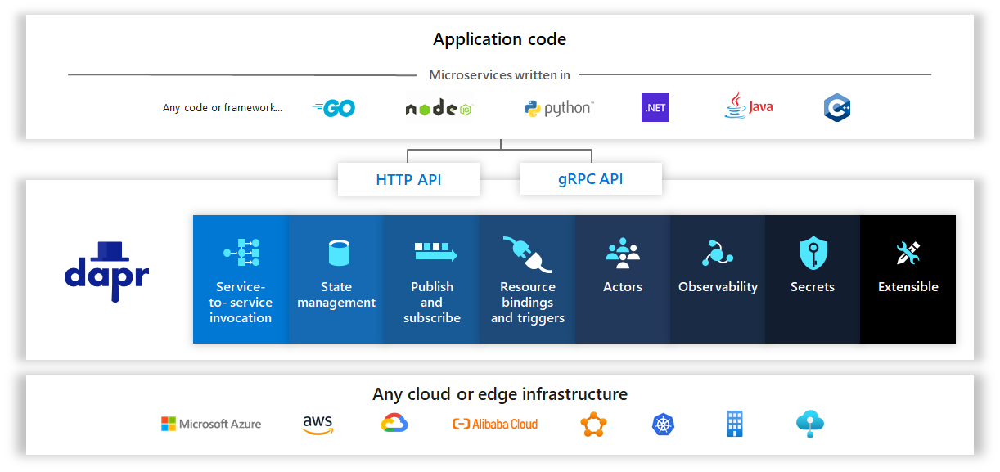


其构建基块基础功能如下：

| 构建基块                                                     | 说明                                                         |
| :----------------------------------------------------------- | :----------------------------------------------------------- |
| [状态管理](https://learn.microsoft.com/zh-cn/dotnet/architecture/dapr-for-net-developers/state-management) | 支持长时间运行的有状态服务的上下文信息                       |
| [服务调用](https://learn.microsoft.com/zh-cn/dotnet/architecture/dapr-for-net-developers/service-invocation) | 使用与平台无关的协议和已知终结点调用直接、安全的服务到服务调用 |
| [发布和订阅](https://learn.microsoft.com/zh-cn/dotnet/architecture/dapr-for-net-developers/publish-subscribe) | 在服务之间实现安全、可缩放的发布/订阅消息传送                |
| [绑定](https://learn.microsoft.com/zh-cn/dotnet/architecture/dapr-for-net-developers/bindings) | 通过双向通信从外部资源引发的事件触发代码                     |
| [可观察性](https://learn.microsoft.com/zh-cn/dotnet/architecture/dapr-for-net-developers/observability) | 监视和度量跨联网服务的消息调用                               |
| [机密](https://learn.microsoft.com/zh-cn/dotnet/architecture/dapr-for-net-developers/secrets-management) | 安全地访问外部机密存储                                       |
| [执行组件](https://learn.microsoft.com/zh-cn/dotnet/architecture/dapr-for-net-developers/actors) | 将逻辑和数据封装在可重用执行组件对象中                       |

与业务程序交互流程如图下：

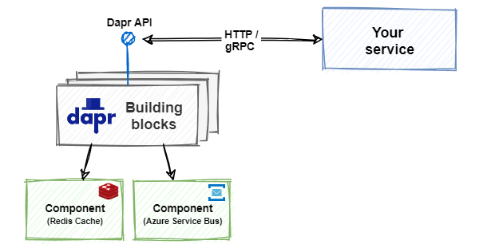


服务之间通信流程如图下：


在开始启用之前，如上阐述了大量关键理论性知识，这将为我们在今后使用或运维时带来极大裨益


**1.启用HttpClient支持**

1.安装`Glasssix.Contrib.Caller.HttpClient`包

2.注册`Caller`

```c#
builder.Services.AddCaller("you service name", options =>
{
    options.UseHttpClient(client => client.BaseAddress = "http://localhost:5000");
});
```

3.使用`ICallerFactory`工厂进行实例创建

```c#
app.MapGet("/Test/Order/Hello", ([FromServices] ICallerFactory callerFactory, string name) =>
{
    var orderCaller = callerFactory.Create("you service name");
    return orderCaller.GetAsync<string>($"/Hello", new { Name = name });
});
```


**高阶用法：**

1.注册`Caller`

```
builder.Services.AddAutoRegistrationCaller();
```

2.创建自定义类，并继承**HttpClientCallerBase**

```c#
using Glasssix.Contrib.Caller.HttpClient;

namespace Demo.DependencyInjection
{
    public class CustomCaller: HttpClientCallerBase
    {
        protected override string BaseAddress { get; set; } = "http://localhost:5000";

        public Task<string?> HelloAsync(string name)=> Caller.GetAsync<string>($"/Hello", new { Name = name });
    }
}
```

3.使用自定义`Caller`

```c#
app.MapGet("/Test/User/Hello", ([FromServices] CustomCaller caller, string name) => caller.HelloAsync(name));
```


**2.启用DaprClient支持**

1.安装`Glasssix.Contrib.Caller.DaprClient`包

2.注册`Caller`

```c#
builder.Services.AddCaller("you service name", options =>
{
    //name可以是任意字符串, 但不可重复添加两个相同 name 的Caller实现
    options.UseDapr(clientBuilder =>
    {
        clientBuilder.AppId = ""; //指定服务对应Sidecar的AppId
    });
});
```

3.使用`ICallerFactory`工厂进行实例创建

```c#
app.MapGet("/Test/User/Hello", ([FromServices] ICallerFactory callerFactory, string name)=>
{
    var caller = callerFactory.Create($"you service name");
    return caller.GetAsync<string>($"/Hello", new { Name = name }));
}
```


**高阶用法：**

1.注册`Caller`

```c#
//注意：若未做基础框架引用的话此处需要拉取配置中心包并进行注册
//builder.AddGlasssixConfiguration();

builder.Services.AddAutoRegistrationCaller();

```

2.创建自定义类，并继承**HttpClientCallerBase**

```c#
using Dapr.Client;
using Glasssix.BuildingBlocks.Service.Caller;
using Glasssix.BuildingBlocks.Service.Caller.Extensions;
using Microsoft.Extensions.Options;
using Rpc.DaprTestService;

namespace Glasssix.Contrib.Caller.DaprClient.Test
{
    public class CustomDaprCaller : DaprCallerBase
    {
        protected override string AppId { get; set; }

        //服务地址配置
        public override Action<DaprClientBuilder> Configure { get; set; } = new Action<DaprClientBuilder>(sp =>
        {
            var config = GlasssixIocApp.GetRequiredService<IOptions<AppConfig>>();
            sp.UseHttpEndpoint(config.Value.HttpEndpoint);
            sp.UseGrpcEndpoint(config.Value.GrpcEndpoint);
        });

        //重写注入事件增加中间件
        protected override GlasssixDaprClientBuilder UseDapr()
        {
            this.AppId = GlasssixIocApp.GetRequiredService<IOptions<AppConfig>>().Value.AppId;
            var daprClientBuilder = base.UseDapr();
            daprClientBuilder.AddMiddleware<LogCallerMiddleware>();
            return daprClientBuilder;
        }

        /// <summary>
        /// 获取Get请求
        /// </summary>
        /// <returns></returns>
        public async Task<string?> GetAsync() => await Caller.GetAsync<string>($"/get");


        /// <summary>
        /// 通过Grpc获取Get请求
        /// </summary>
        /// <returns></returns>
        public async Task<string> GetRpcAsync()
        {
            var okds = await GetAsync();
            var result = await this.Caller.SendGrpcAsync<HelloRequest, HelloReply>($"/get", new HelloRequest() { Name = "1" });
            return result.Message;
        }

    }

    public class LogCallerMiddleware : ICallerMiddleware
    {
        public Task HandleAsync(GlasssixHttpContext GlasssixHttpContext, CallerHandlerDelegate next, CancellationToken cancellationToken = default)
        {

            Console.WriteLine("请求Get接口");

            return next();
        }
    }

}
```

3.使用自定义`Caller`

```c#
app.MapGet("/get", async ([FromServices] CustomDaprCaller callerFactory) =>
{
    var result = await callerFactory.GetAsync();
    return result;
});
```


## 3.8 分布式存储

分布式存储市面上有很多开源项目， 谷歌GFS,腾讯TFS,ceph,FastDFS等等，考虑到当下社区环境和文献资料的缺失，及业务契合度表现，框架选择minio作为存储解决方案提供程序

需要注意的是，在大文件或并发场景下进行文件io时，组件表现不会非常理想，框架此处只提供minio的组件实例

后续的优化及最终解决方案还在预研中

3. DI

   ~~~~ C#
   builder.Services.AddMinio(sp => builder.Configuration.GetSection(builder.Configuration["Minio"]).Bind(sp));
   ~~~~

4. IOC

   ~~~~c#
   private readonly MinioClient _minio;
   
   public XXXController(MinioClient minio)
         {
             _minio = minio;
         }
   ~~~~

5. Methods

   5.1 异步上传

   ~~~~c#
      await _minio.UploadAsync(string name, byte[] array, string bucketName = null);
   ~~~~

   5.2 同步上传

   ~~~~C#
       _minio.Upload(string name, byte[] array, string bucketName = null);
   ~~~~

   5.3 设置桶策略

   ~~~~c#
      _minio.SetPolicy();
   ~~~~

   5.4  文件授权

   ~~~~c#
      string url = await _minio.FileAuthorized(string fromObjectName, string type, ServerSideEncryption sseSrc = null, ServerSideEncryption sseDest = null);
   ~~~~

   5.5 根据文件名称获取文件流

   ~~~~c#
      using MemoryStream ms = await _minio.GetStreamAsync(string name, string type);
   ~~~~

   5.6 根据Url获取文件流

   ~~~~c#
      using MemoryStream ms = await _minio.GetStreamAsync(string url);
   ~~~~

   5.7 解析图片地址

   ~~~~c#
      string name = _minio.GetBuckObjectName(string url);
   ~~~~

   5.8 根据拓展名获取，context type

   ~~~~c#
      string type = _minio.GetContextType(string key);
   ~~~~


## 3.9 Grpc 远程方法调用

RPC是指远程过程调用，也就是说两台服务器A，B，一个应用部署在A服务器上，想要调用B服务器上应用提供的函数/方法，由于不在一个内存空间，不能直接调用，需要通过网络来表达调用的语义和传达调用的数据


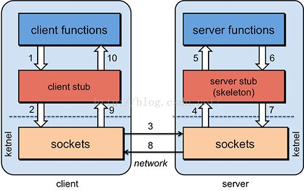

**框架使用谷歌基于rpc协议包装的开源框架Grpc**

GRPC是一个高性能、通用的开源RPC框架，基于`底层HTTP/2协议标准`和`协议层Protobuf序列化协议`开发

也是基于以下**理念**：定义一个服务，指定其能够被远程调用的方法（包含参数和返回类型）。在服务端实现这个接口，并运行一个 gRPC服务器来处理客户端调用。在客户端拥有一个存根能够像服务端一样的方法


**服务端：**

示例：需要预定义proto协议文件

项目*.csproj文件需要进行如下声明

 <ItemGroup>
		<Protobuf Include="Grpc\Protos\*.proto" GrpcServices="Server" />
     	</ItemGroup>

```protobuf
syntax = "proto3";
option csharp_namespace = "Rpc.DemoService";
package Demo;
import  "Grpc/Protos/core.proto";

service RpcDemoService {
  rpc GetList (Input) returns(Helper.Grpc.Core.Result);
}

message Input{
	int32 id=1;
}

```

```C#
 [GrpcServer]//服务端注解，标记后框架会自动进行注册
    public class DemoRpcServer : RpcDemoService.RpcDemoServiceBase
    {
        private readonly ILogger<DemoRpcServer> _logger;
        private readonly IDemoService _service;

        public DemoRpcServer(ILogger<DemoRpcServer> logger, IDemoService service)
        {
            _logger = logger;
            _service = service;
        }
     }
```


**客户端：**

同理 定义proto 进行声明

 <ItemGroup>
		<Protobuf Include="Grpc\Protos\*.proto" GrpcServices="Client" />
     	</ItemGroup>

DI:

```
builder.Services.AddGrpcClient<RpcDemoService.RpcDemoServiceClient>(option =>
{
    option.Address = new Uri("https://localhost:7155");
    //option.Interceptors //������
});
```

**RpcDemoServiceClient** 应用层业务逻辑在构造时依赖注入即可调用


## 3.10 Emqx 客户端 简单实现

1. DI

   ~~~~ C#
   builder.Services.AddMqttClient(sp => builder.Configuration.GetSection(builder.Configuration["emqx"]).Bind(sp));
   ~~~~
   
4. IOC

   ~~~~c#
   private readonly IMqttClient _emq;
   
   public XXXController(IMqttClient emq)
         {
            _emq = emq;
         }
   ~~~~

5. Methods

   5.1 获取用户端实例

   ~~~~c#
      var client = await _emq.GetMqttClientInterface();
   ~~~~

   5.2 发布

   ~~~~C#
       bool isOk = _emq.PublishAsync(string topic, string body);
   ~~~~

   5.3 订阅

   ~~~~c#
      _emq.Subscribe(string topic);
   ~~~~


## 3.11 Emqx 客户端 模板化订阅

1.  依赖注入 

```c#
builder.Services.AddMqttClient(sp =>
            {
                sp.Broker = "10.168.1.47"; // ip
                sp.Port = 30014; // 端口      
                sp.Username = "system"; // 用户名
                sp.Password = "1234qwer"; // 密码
                sp.ClientId = "clientid"; // 自定义客户端id
            },
Assembly.GetExecutingAssembly(),Assembly.Load("Foo.Service")); // 放有订阅类的程序集数组
```

2. 消息发布

```c#
using Glasssix.Contrib.Message.Emqx.MultipleImplementation;
using MQTTnet.Client;

public class WTFPublisher
{
    private readonly IMessageQueueClient _messageQueue;

    public WTFPublisher(IMessageQueueClient messageQueue)
    {
        _messageQueue = messageQueue;
    }

    public Task<MqttClientPublishResult> PublishAMessageAsync(string topic, string body)
    {
        // TODO ...
        return _messageQueue.PublishAsync(topic, body);
    }
}
```

3. 消息订阅

```c#
using Glasssix.Contrib.Message.Emqx.MultipleImplementation.Attribuites;
using Glasssix.Contrib.Message.Emqx.MultipleImplementation.Interfaces;

[Message("/topic/foo")]
public class WTFHandler : MessageHandlerBase
{
    private readonly ILogger<WTFHandler> _logger;

    public WTFHandler(ILogger<WTFHandler> logger)
    {
        _logger = logger;
    }

    public override Task HandleAsync(MqttNetMessage message)
    {
        _logger.LogInformation("{_},{__},{___}", message.ClientId, message.Topic, message.Data);

        return Task.CompletedTask;
    }
}
```


## 3.12 审计日志

框架提供一个可扩展的**审计日志系统**,自动化的根据**约定**记录审计日志,并提供**配置**控制审计日志的级别.

一个**审计日志对象**(参见下面的审计日志对象部分)通常是针对每个web请求创建和保存的.包括;

- **请求和响应的细节** (如URL,HTTP方法,浏览器信息,HTTP状态代码...等).

- **执行的动作** (控制器操作和应用服务方法调用及其参数).

- **实体的变化** (在Web请求中).

- **异常信息** (如果在执行请求发生操作).

- **请求时长** (测量应用程序的性能).

  

​		框架默认启用


## 3.13 链路追踪

非侵入性使用

可选项，特定场景下进行配置启用


## 3.14 分布式锁

内置于缓存组件中，详参框架模板


# 四、API控制

## 4.1 自动Api控制器

**简介**

使用WebApi应用程序，通常需要创建API控制器以将此服务公开为HTTP(REST)Api端点. 典型的Api控制器除了将方法调用重定向到应用程序服务并使用[HttpGet],[HttpPost],[Route]等属性配置REST API之外什么都不做

框架可以自动将当前服务进行curd接口创建生成，也可以通过重写进行自定义业务实现

自动Api发现，通过数据仓储实现curd接口自动生成，默认实现需要授权认证依赖

**前提条件： 实现数据仓库注入，详参3.1章节**

**实现授权认证，详参2.1.6章节**


**Curd控制器**

**SampleController<TDto, TInput>**

实现示例如下图：

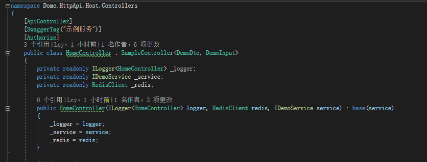


默认控制器需要继承 **SampleController<TDto, TInput>**  并在构造函数中提供基于数据仓库实现的该业务服务接口实例 例：**IDemoService**


**Base控制器**

**BaseApiController**

对于不需要默认curd功能但有依赖其他内部方法及属性可以进行该控制器继承

默认实现：(可重写)

- **获取当前登录用户：   protected virtual string GetUserName()**
- **获取当前登录用户角色：protected virtual List<string> GetRoleName()**
- **获取当前用户Token：  protected virtual string GetToken()**


下图显示了[Swagger UI](https://swagger.io/tools/swagger-ui/)上的API内容:

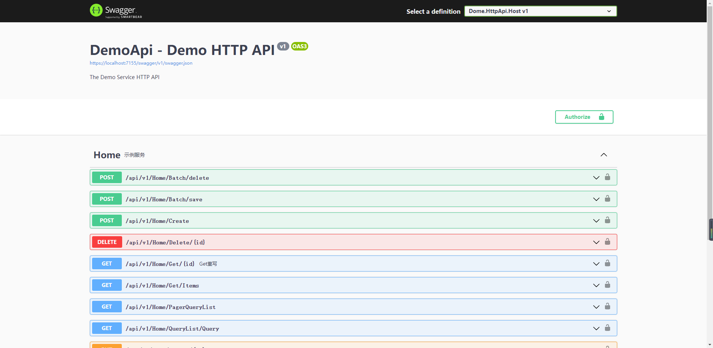


**例子**

一些示例方法名称和按约定生成的相应路由:

| 服务方法名称                                                 | HTTP Method | 路由                         | 说明       |
| ------------------------------------------------------------ | ----------- | ---------------------------- | ---------- |
| BatchAsync(String id)                                        | POST        | /api/v1/Home/Batch/delete    | 批量删除   |
| BatchAsyncAsync(String[] creationList,String[] updateList,String[] deleteList) | POST        | /api/v1/Home/Batch/save      | 批量创建   |
| CreateAsync(T input)                                         | POST        | /api/v1/Home/Create          | 创建       |
| DeleteAsync(String id)                                       | DELETE      | /api/v1/Home/Delete/{id}     | 根据Id删除 |
| GetAsync(String id)                                          | GET         | /api/v1/Home/Get/{id}        | 根据Id筛选 |
| GetItemsAsync(Guid id)                                       | GET         | /api/v1/Home/Get/Items       | 获取项列表 |
| GetQueryListAsync(T input)                                   | GET         | /api/v1/Home/PageQueryList   | 分页查询   |
| QueryListAsync(T input)                                      | GET         | /api/v1/Home/QueryList/Query | 查询列表   |
| UpdateAsync(String id)                                       | PUT         | /api/v1/Home/Update/{id}     | 根据Id修改 |


**AOP**

基础控制器默认实现以下过滤器：

-   **[ValidateModelState] 模型验证过滤器**
-   **[ExceptionHandler] 异常处理过滤器**
-   **[ErrorLog] 错误日志过滤器**
-   **[TraceLog] 跟踪日志过滤器**


注：业务控制器在继承后默认实现此功能，无需手动进行拦截器注入

**版本控制**

API版本默认为v1，自定义控制于今后迭代

……


# 五、Nuget提供列表

## 5.1 主框架

Glasssix.DotNet.Framework 框架基础库

考虑nuget包维护问题，若干包标注为非正式版本不对外公开

可独立使用包nuget包声明上标记详细备注，以实际使用为主


# 六、版本更新日志

## 6.1 版本 V1.0.1，新特性[2022-06-15]

## 6.2 版本 V1.0.2，新特性[2022-08-21]

## 6.3 版本 V2.1.0，新特性[2023-02-02]

1.增加后台服务 xxljob支持 

2.eventbus组件 连接池优化 增加集群连接

## 6.4 版本 V2.1.1，新特性[2023-02-03]

1.增加基础框架示例模板

## 6.5 版本 V2.1.2，新特性[2023-02-09]

1.增加认证鉴权中心


2.基础框架依赖包做拆分

3.增加自动Api控制器

## 6.6 版本 V2.1.3，新特性[2023-02-12]

1.新增选项包，Glasssix.Utils.Configuration

基于微软Ioption<>进行拓展

2.增加框架内部ioc容器，GlasssixApp

3.增加全局异常组件

## 6.7 版本 V2.1.4，新特性[2023-2-23]

1.新增Elasticsearch完整支持 

nuget包 【Glasssix.Contrib.Data.Storage.Elasticsearch】

2.重写redis模块组件

去掉原有Redis.client实现，增加多级缓存

抽象服务工厂，`IDistributedCache` 接口 `IMultilevelCacheClient` 接口 详细参考框架模板

3.新增Dapr跨进程通信组件 依赖封装

## 6.8 版本 V2.1.5，新特性[2023-2-28]

1.框架组件包重命名

## 6.9 版本 V2.1.6，新特性[2023-3-06]

1.分布式锁调整 

- 阻塞式锁（任务终会运行）

- 跳过式锁（存在则跳过）

2.鉴权模块细节优化，增加受众者验证及客户端密钥验证，框架注入必须传入

## 6.10 版本 V2.1.9，新特性[2023-3-08]

1.完善配置选项，详参2.4章节

2.增加Http协议下服务通信能力，详参3.8章节

## 6.11 版本 V2.2.2，新特性[2023-3-13]

1.数据仓储增加自动注入方式，业务无特殊自定义实现下推荐使用此方式

2.修复DaprClient包T,OUT方法返回时，grpc框架自身提示的消息体错误问题

## 6.11 版本 V2.2.5.1，新特性[2023-4-4]

1.增加健康检查。用于容器探针使用,包含第三方中间件健康检查

## 6.12 版本 V2.2.6.3 ,新特性[2023-5-31]

1.多版本支持  .net6 .net7

2.依赖模块迭代为.netStandard2.1

3.Emqx新增多实现 业务标注特性使用，详参此章节

4.完善 Emqx业务标注特性使用文档

5.新增.net7特性方法 固定窗口限流算法 （需业务使用.net7可使用）
